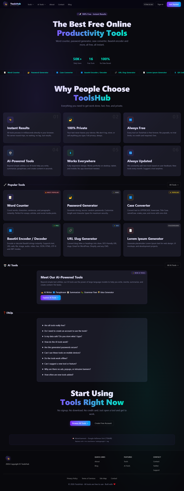
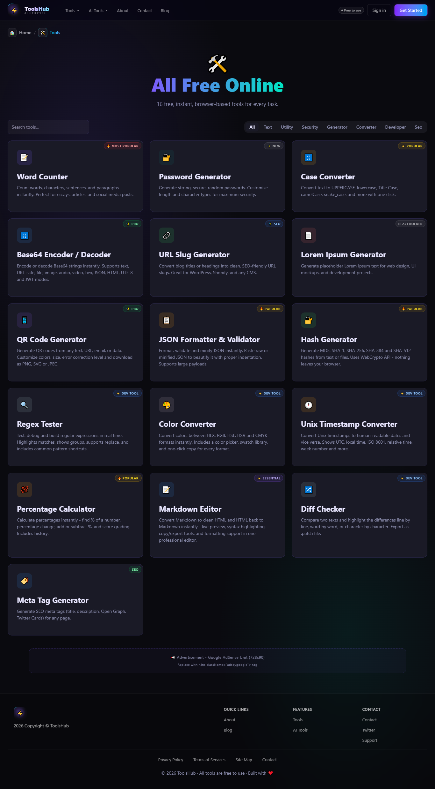

<div align="center">


# 🧰 ToolsHub

### A fast, modern, free online tools collection for developers, designers & everyday users.

[](https://nextjs.org/)
[](https://www.typescriptlang.org/)
[](https://tailwindcss.com/)
[](https://vercel.com/)

[](./LICENSE)
[](./CONTRIBUTING.md)
[](https://toolshub-lake.vercel.app/)

**[🌐 Live Demo](https://toolshub-lake.vercel.app/) · [📖 Blog](https://toolshub-lake.vercel.app/blog) · [🐛 Report Bug](../../issues) · [✨ Request a Tool](../../issues)**

</div>

---

## 📸 Screenshots

<div align="center">

| Homepage | Tools Page | Blog Page |
|----------|------------|-----------|
|  |  |  |

</div>

> **Tip:** Add screenshots to `/public/screenshots/` — they make a huge difference for first-time visitors!

---

## ✨ Features

| Feature | Description |
|---------|-------------|
| ⚡ **Ultra-Fast Performance** | Lighthouse score 95+ across all categories |
| 🧠 **SEO Optimized** | Sitemap, Robots.txt, Open Graph, JSON-LD Schema |
| 📱 **Fully Responsive** | Mobile-first design, works on all screen sizes |
| 🛠️ **13+ Free Tools** | Developer and designer utilities, no login required |
| 📰 **Blog System** | SEO-optimized educational content built-in |
| 🚀 **CI/CD Deployment** | Auto-deploy via GitHub + Vercel integration |
| 🔍 **GSC Integrated** | Google Search Console connected for indexing insights |

---

## 🛠️ Tools Available

<div align="center">

| Category | Tools |
|----------|-------|
| 📝 **Text** | Word Counter, Case Converter, Diff Checker, Markdown Editor |
| 🔐 **Security** | Password Generator, Base64 Encoder / Decoder |
| 🎨 **Design** | Color Converter, QR Code Generator |
| 🧑‍💻 **Developer** | JSON Formatter & Validator, Regex Tester, Meta Tag Generator |
| 🔢 **Utility** | Timestamp Converter, Percentage Calculator |

</div>

> 💡 More tools are being added regularly. [Request one here](../../issues/new).

---

## 📰 Blog System

Built-in SEO blog covering topics like:

- ✅ How to use online tools effectively
- ✅ Developer utility guides
- ✅ SEO best practices
- ✅ Beginner-friendly tutorials

All posts are statically generated for maximum performance.

---

## 🚀 Getting Started

### Prerequisites

- [Node.js](https://nodejs.org/) v18+
- npm or yarn

### Installation

```bash
# 1. Clone the repository
git clone https://github.com/your-username/toolshub.git
cd toolshub

# 2. Install dependencies
npm install

# 3. Run the development server
npm run dev
```

Open [http://localhost:3000](http://localhost:3000) in your browser. 🎉

### Build for Production

```bash
npm run build
npm start
```

---

## 🌍 Deployment

This project is deployed on **Vercel** with automatic CI/CD:

1. Push to the `main` branch
2. Vercel auto-builds and deploys
3. Live in seconds ⚡

[](https://vercel.com/new/clone?repository-url=https://github.com/your-username/toolshub)

---

## 📈 SEO Setup

- ✅ `sitemap.xml` — auto-generated
- ✅ `robots.txt` — configured
- ✅ Open Graph meta tags
- ✅ JSON-LD structured schema
- ✅ Optimized internal linking
- ✅ Google Search Console connected

---

## 📊 Project Status

| Feature | Status |
|---------|--------|
| ⚡ Performance | ✅ Optimized (95+ Lighthouse) |
| 🧠 SEO | ✅ Fully implemented |
| 🔍 Google Indexing | ⏳ In progress |
| 🚀 Deployment | ✅ Live on Vercel |
| 🛠️ New Tools | 🔄 Continuously adding |

---

## 🤝 Contributing

Contributions are welcome! Here's how you can help:

1. **Fork** this repository
2. **Create** a feature branch: `git checkout -b feature/new-tool`
3. **Commit** your changes: `git commit -m "feat: add new tool"`
4. **Push** to the branch: `git push origin feature/new-tool`
5. **Open** a Pull Request

Please make sure your code follows the existing style and all tools are responsive.

---

## 👨‍💻 Author

<div align="center">

**Built with ❤️ by Arsalan**

*Focused on building fast, SEO-friendly, free web tools.*

[](https://github.com/your-username)

</div>

---

## 📄 License

This project is for **educational and portfolio use**.
Feel free to fork, learn from, and build upon it.

---

<div align="center">

⭐ **If you found this useful, please star the repo!** ⭐
*It helps others discover the project and motivates further development.*

</div>